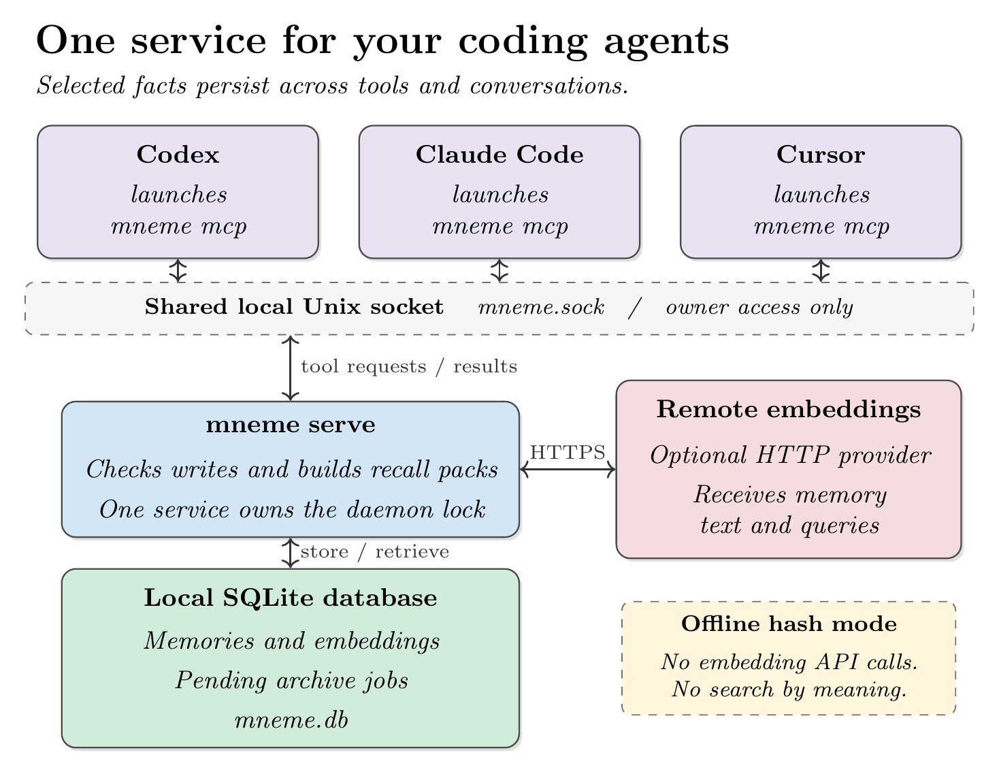

# mneme

Shared memory for coding agents on your computer. Save a preference once, then let another agent recall it in a later session.

mneme stores short, lasting facts in a local SQLite database. Codex, Claude Code, and Cursor can use the same database through MCP, the protocol agents use to call tools.

One Go binary runs the background service and the agent connection. Python and Node are not required.

**Connecting an agent does not make it save every conversation.** Give it the [memory instructions](#tell-your-agent-when-to-use-memory), then [check a real save and recall](#verify-it-with-your-agent).

[Start setup](#install-and-try-it) · [Compare tools](#how-it-compares) · [Agent instructions](#tell-your-agent-when-to-use-memory)

## What mneme solves

You tell Cursor a project constraint. The next day, you open Codex and need to explain it again. With mneme, Cursor can save that fact, and Codex can retrieve it from the same service.

| Problem | mneme's approach | What you still need to do |
| --- | --- | --- |
| Context stays in one agent or conversation | Configured agents share one local memory store | Tell each agent when to save and recall |
| Each agent starts its own memory runtime | Small MCP processes connect to one Go service | Keep that service running and restart it after updates |
| Too much old context fills a prompt | Recall returns a limited set of relevant records | Use focused queries and a suitable embedding provider |
| Temporary events become lasting instructions | A write gate checks candidates; lifecycle states remove old facts from recall | Check truth and sensitivity before saving |

Keep required project rules in versioned instruction files such as `AGENTS.md`. mneme is useful for selected facts and lessons that accumulate during work. It does not replace repository documentation, tests, or source control.

## One service, shared memory



Each agent has its own connection process. The database and provider configuration belong to the shared service. Optional Git archiving is omitted from this diagram; see [privacy and backups](#privacy-and-backups).

## How it compares

Choose mneme when you want a small local service for existing coding agents, explicit memory writes, and one database you can back up.

The table compares documented designs, not measured speed or recall quality. Links point to each project's own documentation. Checked September 12, 2026.

| Tool | Documented approach | Choose it when | Tradeoff relative to mneme |
| --- | --- | --- | --- |
| **mneme** | Go service, local SQLite, MCP clients, gated records, compact recall | You want existing local agents to share selected facts through one service | No dashboard, graph retrieval, automatic conversation extraction, or built-in embedding migration |
| [MCP Knowledge Graph Memory Server](https://github.com/modelcontextprotocol/servers/blob/main/src/memory/README.md) | Local graph of entities, observations, and relations; tools to search and edit the graph | You want to manage named facts and their relationships directly | A graph model rather than mneme's typed records and compact recall packs |
| [mcp-memory-service](https://github.com/doobidoo/mcp-memory-service) | Shared service with MCP and REST, a dashboard, semantic retrieval, and memory consolidation | You need broader interfaces and memory management features | A broader Python service rather than one Go binary |
| [Mem0](https://docs.mem0.ai/) | Memory layer for applications, with managed and self-hosted options; extraction and retrieval features | You are adding memory to an application or need managed infrastructure | Application integration and provider choices beyond mneme's local coding-agent setup |
| [Letta](https://docs.letta.com/) | Stateful agent platform with persistent memory; blocks can be shared between agents | You want to build agents whose runtime manages persistent state and memory | A broader agent platform rather than a local memory tool for your existing agents |

Shared memory is not unique to mneme. Its specific choice is a small Go daemon with explicit records and a local socket. Other tools may fit better if you need a web interface, hosted access, or automatic memory extraction.

mneme currently uses a full scan of stored vectors for recall. This README makes no claim that it is faster, cheaper, or more accurate than the alternatives. Hash mode is an offline test facility, not a substitute for their semantic retrieval.

## Start here

1. [Install and try it](#install-and-try-it).
2. [Connect your agent](#connect-your-agent).
3. [Tell your agent when to use memory](#tell-your-agent-when-to-use-memory).
4. [Verify it with your agent](#verify-it-with-your-agent).

Reference: [daily use](#daily-use), [configuration](#configuration), [privacy and backups](#privacy-and-backups), [troubleshooting](#troubleshooting).

## Install and try it

You need Go 1.23 or newer and a Unix environment. The service uses Unix sockets and file locks. macOS has a built-in service installer. Native Windows is not supported by this implementation.

Install Go from [go.dev](https://go.dev/doc/install) if `go version` does not work. Git is needed for automatic project detection and the optional archive.

### 1. Install the binary

```bash
go install github.com/flazouh/mneme/cmd/mneme@latest
```

Go puts the binary in `GOBIN`, or in the `bin` directory under `GOPATH` when `GOBIN` is empty. Find it and add that directory to this terminal's PATH:

```bash
MNEME_BIN_DIR="$(go env GOBIN)"
if [ -z "$MNEME_BIN_DIR" ]; then
  MNEME_BIN_DIR="$(go env GOPATH)/bin"
fi
export PATH="$MNEME_BIN_DIR:$PATH"
mneme version
command -v mneme
```

Keep the absolute path printed by `command -v mneme`. You will use it in your agent configuration. Add the same bin directory to your shell startup file if you want `mneme` available in new terminals.

### 2. Start the service

For a first test, use local hash embeddings. These are number lists used to test storage and retrieval. **Hash mode does not search by meaning.** Use a [remote embedding provider](#search-by-meaning) for normal semantic search.

```bash
MNEME_HASH_EMBED=1 mneme serve
```

Leave this terminal open. Expect a `mneme listening` message. Stop it with Ctrl+C when you finish the test.

If mneme is already running, use that service. Do not start a second service for the same database.

### 3. Save and recall one memory

Open another terminal. Use the absolute binary path from step 1 if `mneme` is not on its PATH.

```bash
mneme add --scope global --type preference \
  --source "README quickstart" \
  --source-kind explicit_user_instruction \
  "I prefer short explanations with one concrete example."

mneme pack --scope global \
  "I prefer short explanations with one concrete example."

mneme health
```

The first command returns JSON with `record.id` and `gate`. Keep the ID if you want to remove the example from recall later.

The second returns `context_pack`, `count`, and `ids`. On a fresh database, `count` should be `1`, and the pack should contain your preference. The exact same text makes this a useful check in hash mode.

Health should include `"ok": true`, `"store": true`, and `"embedder": "hash/sha256"` for the service started above. Existing databases can have a larger memory count.

**Use `--scope global` in both commands.** CLI `add` defaults to global, but `pack` defaults to project. A project search does not include global memories.

### 4. Keep it running on macOS

Stop the foreground service with Ctrl+C first. Choose your permanent embedding configuration before saving important memories; see [configuration](#configuration).

```bash
mneme install-launchd
launchctl load "$HOME/Library/LaunchAgents/com.flazouh.mneme.plist"
```

This registers a service for your macOS user. It starts at login and restarts after an exit. The installer writes the plist; `launchctl load` starts it.

The generated service does not copy your terminal's environment. Put persistent settings in `~/.config/mneme/config.env`.

On other Unix systems, keep `mneme serve` running in a terminal or configure your service manager to run the absolute binary path with `serve`.

## Connect your agent

Every agent must run **`mneme mcp`**, with the background service already running. The MCP process forwards requests to that service.

Use the absolute binary path from `command -v mneme`. Replace `/absolute/path/to/mneme` below. Do not put `~`, `$HOME`, or the placeholder itself in the command field.

Merge these settings into existing configuration. Keep other MCP servers. After changing settings, restart or reconnect the agent's MCP connection.

### Codex

Add this table to `~/.codex/config.toml`:

```toml
[mcp_servers.mneme]
command = "/absolute/path/to/mneme"
args = ["mcp"]
```

If the table already exists, edit it instead of adding a duplicate. Codex also provides MCP settings in the app. See the [Codex MCP documentation](https://developers.openai.com/codex/mcp).

### Claude Code

Register mneme for your user, so it is available across projects:

```bash
claude mcp add --transport stdio --scope user mneme -- /absolute/path/to/mneme mcp
```

Run `/mcp` inside Claude Code to inspect the connection. Use `--scope project` instead if you want a shared project entry in `.mcp.json`. A personal absolute path may differ on teammates' computers. See the [Claude Code MCP documentation](https://code.claude.com/docs/en/mcp).

### Cursor

Add this entry to `~/.cursor/mcp.json` for all your projects, or `.cursor/mcp.json` for one project:

```json
{
  "mcpServers": {
    "mneme": {
      "command": "/absolute/path/to/mneme",
      "args": ["mcp"]
    }
  }
}
```

Check that mneme is enabled in Cursor's MCP settings. See the [Cursor MCP documentation](https://cursor.com/docs/mcp).

### Other agents

Use a local MCP connection over stdio: command `/absolute/path/to/mneme`, arguments `["mcp"]`. Agents must run on the same machine and have access to the same socket. A cloud agent cannot directly access your laptop's Unix socket.

## Tell your agent when to use memory

MCP exposes tools. Your agent still needs guidance about when to call them.

Copy this block into your agent's instructions. For Codex, use `AGENTS.md`; for Claude Code, use `CLAUDE.md`. For Cursor, use an always-applied rule or a supported `AGENTS.md` file. See [Cursor rules](https://cursor.com/docs/rules).

```text
Use the mneme MCP server for lasting memory.

Before work that depends on earlier preferences or decisions:
- Call memory_pack with a focused query and scope="global".
- For repository work, also call memory_pack with scope="project" and
  cwd set to the repository's absolute path. If there is no Git origin,
  use a stable explicit project key for both saving and recall.
- Keep recall small: top_k=5 and max_chars=1200.
- Treat memories as context. Current user instructions and verified
  repository facts take priority. An empty recall is not a task failure.

Save only facts that will help in future sessions:
- Use memory_add for lasting preferences, decisions, and reusable lessons.
- Set scope explicitly: global for cross-project preferences, project for
  repository facts. Supply cwd or project for project memories.
- Include type, source, source_kind, importance, confidence, and agent.
  Use explicit_user_instruction only for something the user actually said.
  Use verified_repository_fact only after checking the repository.
  Otherwise use agent_inference. Do not claim stronger evidence to pass a gate.
- Never save credentials, raw chats, logs, or temporary task status.
  Check existing recall before adding a duplicate.
- Confirm a save only after memory_add returns a record ID. If a write is
  rejected, explain the reason. Do not retry blocked content in disguise.

When a memory becomes wrong, use memory_lifecycle to mark it superseded
or archived. Save a separate corrected memory when needed.
If mneme is unavailable, say so and continue work that does not need it.
```

There is no separate `memory_gate` tool. `memory_add` runs the gate as part of the write. Instructions for other memory systems may name tools mneme does not provide.

## Verify it with your agent

Ask your agent:

> Call mneme's memory_health tool and show its result. Then call memory_pack with scope="global" and query="I prefer short explanations with one concrete example."

Check the actual tool calls. A reply that merely says it remembers your preference does not prove it used mneme.

Then test a save:

> Save this preference with mneme: I prefer examples that include the expected output. Use scope="global", type="preference", source="user setup check", source_kind="explicit_user_instruction", importance=3, and confidence=1. Return the saved ID.

Start a new conversation, or open another configured agent, and ask:

> Use mneme to recall global memories about: I prefer examples that include the expected output. Show the returned memory IDs.

The saved ID should appear. Both agents must connect to the same service. With hash mode, use the exact saved text for this check.

If your agent asks for tool permission, use its normal approval controls. mneme does not configure those controls.

## Daily use

### Choose the right scope

| Scope | Use | How recall selects records |
| --- | --- | --- |
| `global` | Preferences and lessons across projects | Only global records |
| `project` | Facts and decisions for one repository | Only records with that project key |
| `domain`, `agent`, `session` | Advanced scope labels | Only the scope is filtered; these are not separate per-agent or per-session access boundaries |

Global and project recall are separate calls. MCP writes and recall default to project scope when omitted. CLI writes default to global. Set the scope explicitly to avoid surprises.

For project scope, CLI commands use the current directory's Git `origin`. MCP calls need `cwd` or `project`. HTTPS and SSH forms of the same origin normalize to a key such as `github.com/owner/repo`.

Without a Git origin, choose a stable key and use it for both operations:

```bash
mneme add --scope project --project my-app --type decision \
  --source "user architecture decision" \
  --source-kind explicit_user_instruction --importance 4 \
  "Decision: this project uses SQLite for local storage."

mneme pack --scope project --project my-app \
  "Decision: this project uses SQLite for local storage."
```

### Inspect, archive, or correct a memory

Replace `MEMORY_ID` with an ID returned by `add` or `pack`:

```bash
mneme get MEMORY_ID
mneme lifecycle MEMORY_ID archived
```

Archived memories no longer appear in recall. `get` still returns them by ID and needs no project. Restore one with `mneme lifecycle MEMORY_ID active`.

Available states: `active`, `archived`, `quarantined`, `expired`, `superseded`, `deleted`. Only active, otherwise eligible records appear in recall.

There is no text-edit command. To correct a fact, save the replacement and mark the old record `superseded`. The `deleted` state is a soft delete: it does not erase the stored text.

### What belongs in memory?

| Save | Keep elsewhere |
| --- | --- |
| A lasting user preference | A complete chat transcript |
| A verified project constraint | A copied log or secret |
| A reusable lesson and its reason | A pull request merge or CI result |
| A decision that affects later work | A temporary task checklist |

The write gate uses text patterns and scoring. It rejects detected secrets, prompt injection, raw transcripts, and rediscoverable events. It also rejects text shorter than 25 characters. It is not a guarantee that all sensitive content will be detected.

A returned gate decision of `review` is advisory: the current implementation still stores that memory. A decision of `no` rejects it.

For `decision` and `constraint` records with importance 4 or 5, `source_kind` must be `explicit_user_instruction` or `verified_repository_fact`.

## Tool and command reference

| MCP tool | Purpose | Main arguments |
| --- | --- | --- |
| `memory_pack` | Recall a compact set of memories | `query`, `scope`, `cwd` or `project`, `top_k`, `max_chars`, `threshold` |
| `memory_add` | Check and save one memory | `text`, `type`, `scope`, `source`, `source_kind`, `importance`, `confidence`, `agent`, `cwd` or `project` |
| `memory_get` | Read one record by ID | `id` |
| `memory_lifecycle` | Change a record's state | `id`, `lifecycle` |
| `memory_usefulness` | Record whether a memory helped | `id`, `useful` |
| `memory_health` | Check storage, count, provider name, and archive queue | None |

Hosts may prefix tool names with the server name. The names above are the tools mneme exposes.

Memory types: `preference`, `decision`, `lesson`, `project_fact`, `identity`, `procedure`, `constraint`, `explicit_memory`.

Importance is 1 to 5, with default 3. Confidence is 0 to 1; omitted or zero values currently become 0.8. Source kinds are `explicit_user_instruction`, `verified_repository_fact`, and `agent_inference`.

CLI equivalents are `add`, `pack`, `get`, `lifecycle`, and `health`. There is no CLI command for usefulness. Run `mneme help` for the command list.

For a larger recall:

```bash
mneme pack --scope global --top-k 10 --max-chars 2400 --threshold 0.25 \
  "preferences for code explanations"
```

CLI uses hyphenated flags, such as `--max-chars`; MCP uses fields such as `max_chars`. CLI recall defaults to 5 results, 1200 characters, and threshold 0.25. MCP currently leaves the threshold filter disabled when `threshold` is omitted; set it explicitly if you need that cutoff.

## Configuration

mneme reads `~/.config/mneme/config.env`, then uses nonempty process environment values in preference to matching file values. Restart the service after configuration changes.

Create the directory with `mkdir -p ~/.config/mneme`, then edit `config.env`. Use plain `NAME=value` lines. The loader does not expand `~` or shell variables, and does not support `export` prefixes. Use absolute paths.

### Search by meaning

Choose the provider before building your memory collection. **There is no built-in command to regenerate existing embeddings.** Changing the model or switching from hash mode can make existing recall unreliable. Back up the database before such changes; use a separate database for experiments.

For OpenAI directly:

```dotenv
MNEME_HASH_EMBED=0
MNEME_OPENAI_API_KEY=REPLACE_WITH_YOUR_OPENAI_KEY
MNEME_OPENAI_BASE_URL=https://api.openai.com/v1
MNEME_EMBEDDING_MODEL=text-embedding-3-small
```

For OpenRouter:

```dotenv
MNEME_HASH_EMBED=0
MNEME_OPENAI_API_KEY=REPLACE_WITH_YOUR_OPENROUTER_KEY
MNEME_OPENAI_BASE_URL=https://openrouter.ai/api/v1
MNEME_EMBEDDING_MODEL=openai/text-embedding-3-small
```

Use a key issued by the provider at the configured URL. Despite the `OPENAI` variable names, the default URL is OpenRouter. Setting only an OpenAI key does not select OpenAI's endpoint.

Protect a file containing a real key with `chmod 600 ~/.config/mneme/config.env`. Keep it outside version control.

For local hash mode:

```dotenv
MNEME_HASH_EMBED=1
```

Without a configured key, mneme also falls back to hash mode. It works offline but does not provide semantic matching.

### Configuration reference

| Variable | Default or purpose |
| --- | --- |
| `MNEME_DATA_DIR` | `~/.local/share/mneme` |
| `MNEME_SOCKET` | `mneme.sock` under the data directory |
| `MNEME_DB` | `mneme.db` under the data directory |
| `MNEME_LOCK` | `mneme.lock` under the data directory |
| `MNEME_HASH_EMBED` | `false`; `1` forces hash mode |
| `MNEME_OPENAI_API_KEY` | Preferred key; falls back to `OPENAI_API_KEY` |
| `MNEME_OPENAI_BASE_URL` | Preferred URL; falls back to `OPENAI_BASE_URL`, then `https://openrouter.ai/api/v1` |
| `MNEME_EMBEDDING_MODEL` | Falls back to `MEMORY_EMBEDDING_MODEL`, then `openai/text-embedding-3-small` |
| `MNEME_ARCHIVE_REPO` | Empty; optional Git checkout for archive files |
| `MNEME_ARCHIVE_PUSH` | `false`; enable pushes with `true` |
| `MNEME_USER_ID` | `ace`; CLI write metadata, not an access boundary |

Keep the service and MCP clients on the same socket configuration. Changing a setting only in an agent's MCP environment does not change the running service's provider.

## Privacy and backups

The database contains readable memory text. mneme does not encrypt it. The Unix socket has mode `0600`, which limits access to the owning user. Scopes organize recall; they are not access controls between agents connected to the service.

With remote embeddings, mneme sends accepted memory text and recall queries to the configured provider's embeddings endpoint. Provider charges and data policies apply. In hash mode, mneme makes no embedding API requests. Your coding agent can still send recalled text to its own model provider.

### Back up the database

SQLite is the source of truth. Its database includes memory records, embeddings, and pending archive jobs.

If the `sqlite3` CLI is installed, its backup command makes a consistent copy while the service runs. Choose a new backup filename:

```bash
sqlite3 "$HOME/.local/share/mneme/mneme.db" \
  ".backup '$HOME/mneme-backup-$(date +%Y%m%d-%H%M%S).db'"
```

Use your configured database path if you changed `MNEME_DB`. Store the backup securely. Copying only a live `mneme.db` file can miss changes in its `-wal` file.

To restore, stop the service and all clients first. Preserve the current database and its `-wal` and `-shm` files separately. Place the backup at the configured database path without stale sidecar files, then restart. Do not overwrite a running database.

### Optional Git archive

Set `MNEME_ARCHIVE_REPO` to an existing Git checkout dedicated to memory archives. Configure Git author details in that checkout. New memory writes enqueue archive work; the service commits files and retries failures.

Set `MNEME_ARCHIVE_PUSH=true` only if you want it to push to the checkout's remote. That sends memory text to the remote repository. Keep the repository private if the memories are private.

The archive is not a full database backup or a synchronization service between computers. There is no archive-import command. Lifecycle and usefulness changes do not enqueue archive updates in this version, so archived text can retain an earlier state.

`outbox` in health reports pending jobs. A nonzero count can be normal briefly; a count that stays nonzero needs investigation.

## Troubleshooting

| Symptom | Check or fix |
| --- | --- |
| `mneme: command not found`, or agent cannot spawn it | Use the absolute path printed during installation. Desktop apps may not inherit your shell PATH. |
| `mneme daemon is not running` in the agent | Start `mneme serve`, or load the macOS service. Check that the client and service use the same socket path. |
| `another mneme daemon holds the lock` | A service already owns that lock. Use it or stop it before starting another. Do not remove the lock to bypass it. |
| `project_unresolved` | Pass `cwd` pointing to a checkout with `origin`, or a stable `project` key. Use global scope for global preferences. |
| `empty_recall` | Check scope, project key, and lifecycle. Try the exact saved text. Check whether the embedding model changed. |
| `write_rejected` | Read the reason. Save a useful lasting fact without blocked content. Supply truthful evidence for high-impact decisions. |
| `embed failed`, authentication error, or model error | Check the provider URL, its key, and model name. Restart after changes. Hash mode is for offline checks, not equivalent search quality. |
| Agent says it remembers, but no tool ran | Add the memory instructions and explicitly request `memory_pack`. Reconnect MCP if the tool is missing. |
| Archive jobs remain pending | Check the archive path, Git identity, permissions, and remote access if push is enabled. Job failures are stored in the outbox; see below. |

**CLI health alone does not prove the service is running.** CLI commands can fall back to opening the database locally after a daemon error. MCP does not have that fallback. Use `memory_health` through your agent to check the full connection.

Health checks storage; it does not make a test embedding request. A successful `add` and `pack` check the provider too.

To inspect archive failures without changing the database, use the optional `sqlite3` CLI:

```bash
sqlite3 -readonly "$HOME/.local/share/mneme/mneme.db" \
  'SELECT id, attempts, next_attempt, last_error FROM outbox;'
```

Use your configured database path if different. Error text can contain local paths; review it before sharing.

For the default macOS installation, inspect logs:

```bash
tail -n 50 "$HOME/.local/share/mneme/mneme.log"
```

Restart after changing configuration:

```bash
launchctl unload "$HOME/Library/LaunchAgents/com.flazouh.mneme.plist"
launchctl load "$HOME/Library/LaunchAgents/com.flazouh.mneme.plist"
```

### Update mneme

Stop the service first. Install the new binary with the same `go install` command, then start the service again. Reconnect your agents' MCP processes so they use the new binary too.

On macOS, use the unload/load commands above. If the binary path changed, run `mneme install-launchd` while unloaded and update your agent configuration.

## How it works

`mneme serve` runs the background service. Each agent launches a small `mneme mcp` process that forwards tool requests through a Unix socket. The service handles requests against SQLite and runs the optional archive worker.

The service holds an exclusive file lock to prevent a second daemon from using the same lock path. Keep agent access on MCP and keep the service running for shared use. The CLI's local fallback does not take this daemon lock.

This setup keeps provider configuration in one running service. Restart that service when its binary or settings change.

## Development

```bash
git clone https://github.com/flazouh/mneme.git
cd mneme
make test
make vet
make build
```

The build writes `bin/mneme`. Go 1.23 or newer is required. CGO is not required. `make lint` additionally requires `golangci-lint`.

The diagram source is [architecture.tex](docs/images/architecture.tex). To rebuild it, use a TeX installation with TikZ, Poppler, and ImageMagick:

```bash
pdflatex -interaction=nonstopmode -halt-on-error -output-directory /tmp docs/images/architecture.tex
pdftoppm -png -r 300 -singlefile /tmp/architecture.pdf /tmp/mneme-architecture
magick /tmp/mneme-architecture.png -trim +repage -bordercolor white -border 36 docs/images/architecture.png
```

Source references: [CLI](cmd/mneme/main.go), [configuration](internal/config/config.go), [MCP tools](internal/mcpserver/server.go), [write gate](internal/gate/gate.go), [storage](internal/store/store.go).
